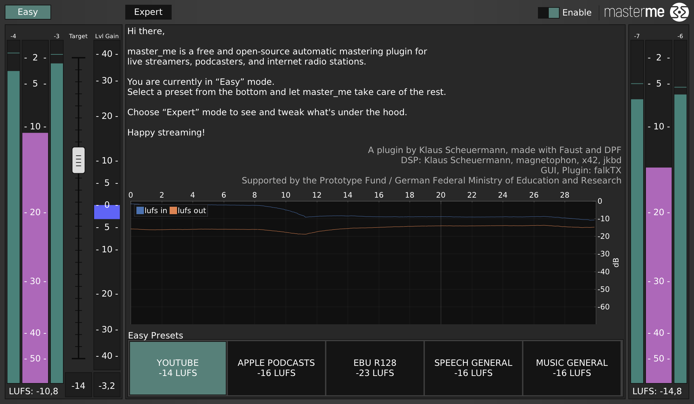
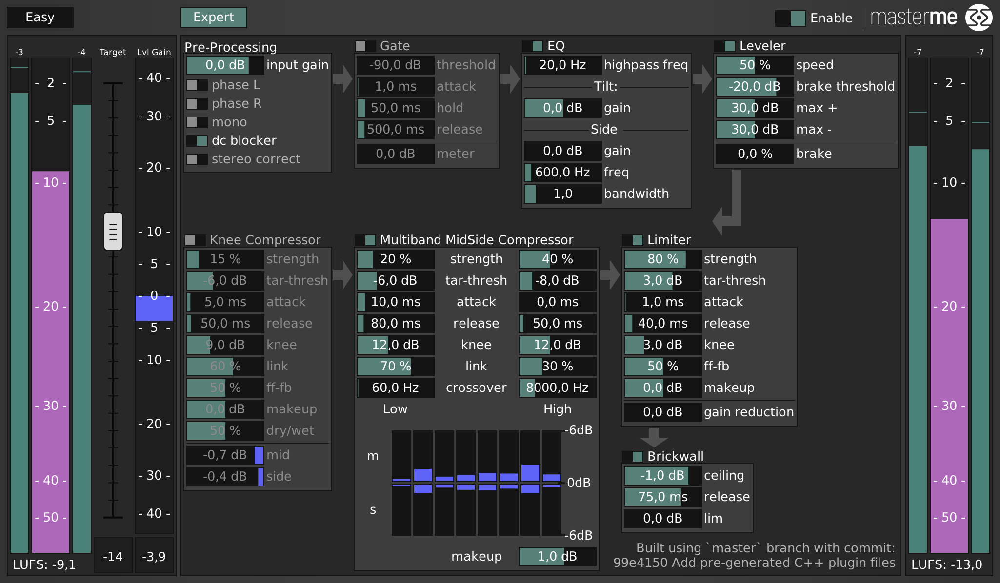

# master_me

Automatic audio mastering plugin for live-streaming and podcasting

# Introduction

With the first Covid-19 related lock-downs in 2019, many real-life concerts, conferences and festivals were forced into the digital domain - and sounded pretty crappy.
Having worked for almost 20 years in audio mastering, Berlin based engineer Klaus Scheuermann started to develop master_me - a word fusion of *automatic mastering* and *mini-me* - in order to make open source streaming sound better.
After a few weeks of learning and development, master_me was first used at the 'Quarantine Sessions' - a weekly distributed electro-acoustic improvised concert, hosted at Stanford's CCRMA Institute.
master_me was developed further to be an easy-to-use tool for all live streaming applications.
In 2022 it was funded by the Prototype Fund, an open source software funding initiative by the german ministry of education and research.
A stable release is available since September 2022.

# Who is master_me for?

master_me is for all live streamers.

It can also be a valuable tool for podcasters and internet radio stations.

# What is mastering

The term 'mastering' usually refers to the last step of sound manipulation in the audio production process.
Historically the vinyl master was used to duplicate records.
Nowadays a digital master is the file which is being duplicated and distributed to streaming or download platforms.

# What is master_me

master_me is a multi platform, free and open source audio plug-in which optimizes sound in live streaming situations.
Introducing no latency, it takes care of master levels and ‘polishes’ the sound with a chain of effects, closely modeled after the audio chain of Klaus Scheuermann’s mastering studio in Berlin, Germany.

Although tempting, it is NOT intended to automatically master your produced music.
Your art deserves closer, offline attention.

# Open Source and licensing

master_me is licensed under GPL3, see the [LICENSE](LICENSE) file for more details.

# System requirements and compatibility

master_me is available in LV2, VST2 and VST3 formats for Linux, macOS and Windows, plus JACK Standalone for some systems.

Due to faust and its open architecture, it can possibly be compiled to a vast variety of target platforms not mentioned above.

# Contributors

Concept and idea: Klaus Scheuermann  
DSP: Klaus Scheuermann (trummerschlunk), Bart Brouns (magnetophon), Robin Gareus (x42), Jakob Dübel (jkbd)  
GUI, Plugin: Filipe Coelho (falkTX)  
Logo, Artwork: Peter Schlossnikel

More contributions from: Julius Smith, Dario Sanfilippo, Stéphane Letz, Romain Michon, Yann Orlarey, the Faust community.

master_me's DSP is written in Faust.  
GUI and Plugin based on DPF (DISTRHO Plugin Framework).

# Thanks to

The Faust community and everyone who supported the project.

# Sponsor

master_me is sponsored by the Prototype Fund, an open source software funding initiative by the German Federal Ministry of Education and Research.

# Quickstart

After Installation, load the plugin on the master channel of your streaming software or DAW.

Choose a preset.

Adjust a target-loudness (optional).

# Interface

## Handling

- Click and drag any parameter vertically or horizontally (except the target slider which only has vertical movement)
- Shift + click to reset to default
- Ctrl + drag to go slower
- Double-click a slider for manual text input

## Easy Mode

The 'Easy' mode is a very reduced GUI to make master_me an easy-to-use tool for all content creators.

Only two choices can be made: choose a preset and set the desired target loudness



# Expert Mode



### Concept

The main concept of master_me is the combination of a leveler and a chain of dynamics processors.

The leveler can be seen as a big volume knob which you would grab, when the sound is too low or too high for your taste.

The following chain is designed to result in a natural, balanced and consistent sound if it is hit at the right level (->leveler).
It will take care of peaks in the audio, like short loud noises and balance the frequency spectrum.

There are some additional modules before the leveler for your convenience.

### Signal Flow

 - Pre-processing
 - Gate
 - EQ
 - Leveler
 - Knee Compressor
 - Multiband Mid-Side Compressor
 - Limiter
 - Brickwall

[![DSP signal flow][image]][hyperlink]

[hyperlink]: https://raw.githubusercontent.com/trummerschlunk/master_me/master/img/soundsgood-svg/process.svg
[image]:
https://raw.githubusercontent.com/trummerschlunk/master_me/master/img/soundsgood-svg/bp2-0x60015018a640.svg
(Click on the image to open, click on the blocks to enter and on the whitespace to exit the blocks)

### Modules

#### Module: pre-processing

The ‘pre-processing’ module contains:

 - a gain-slider to apply gain to the incoming signal before it hits master_me.
 - a ‘mono’ switch
 - phase switches for both left and right channels
 - ‘stereo-correct’ switch (custom designed process, see 'stereo-correct')

#### Module: gate

A simple noise gate with the following parameters:

 - threshold
 - attack
 - release

#### Module: EQ

The EQ offers some simple tools for frequency spectrum manipulation. The parameters are:

 - highpass frequency: the cutoff frequency of a soft highpass filter
 - tilt-gain: gain of a 'tilt' equalizer, which will bend the frequency spectrum either to the higher frequencies or the lower frequencies.
 - side-eq gain: gain parameter of the 'side-eq' which boosts a certain frequency range in the side signal in order to make the sound 'wider'.
 - side-eq frequency: center frequency of the side-eq
 - side-eq bandwidth: width of the side-eq

#### Module: leveler

The leveler is the most critical part of master_me. It will listen to the incoming signal and adjust it's volume to meet the target loudness.
In order to make this as smooth and natural as possible, a complex algorithm was designed. The following parameters can be set:

 - target loudness: in lufs, a slider also available in 'easy' mode, next to the input meters on the left).
   Typical target loudness values are -18lufs for video streaming, -14lufs for podcasting, -23lufs for EBU broadcast standard.
 - brake threshold: this parameter is used by the leveler to detect silence.
   When silence is detected, the leveler 'freezes' and waits for incoming audio before it continues to adjust the loudness.
 - max +: determines the maximum amount of positive gain the leveler can apply to the incoming signal
 - max -: determines the maximum amount of negative gain the leveler can apply to the incoming signal
 - the brake-meter shows silence detection.

#### Module: knee compressor

The knee compressor is a slow and soft mid-side compression module. It functions as a subtile, swinging compressor.
Typical equivalents in the analog domain would be a Manley Stereo VARIABLE MU® compressor or a Vertigo VSC-2.
The following parameters can be set:

 - strength: correlating to the ratio of compression. 0% equals a ratio of 1:1, 100% equals a ratio of 1:infinity
 - tar-thresh: offsets the compressors threshold, dependent on the target loudness.
 - attack: compressor's attack time in milliseconds
 - release: compressor's release time in milliseconds
 - knee: compressor's knee in dB
 - link: amount of gain reduction linking between mid and side channels
 - ff-fb: feedforward-feedback determines, where the compressor receives it's side-chain signal from.
   feedforward is the input of the compressor, feedback is the output of the 'brickwall' module.
 - make-up: simple gain makeup after compression
 - dry-wet: fades between the input signal and the compressed signal
 - the meters show the amount of compression on each channels

#### Module: multiband mid/side compressor

Being perhaps the most complicated module of master_me, this module works like this:

The audio is first converted from stereo to mid-side and then split into 8 frequency bands.
The parameters apply to the lowest band (low) and the highest band (high).
For the 6 bands in between, the parameters are interpolated between 'low' and 'high'.

The parameters for the lowest and highest band are:
 - strength: correlating to the ratio of compression. 0% equals a ratio of 1:1, 100% equals a ratio of 1:infinity
 - tar-thresh: offsets the band's threshold, dependent on the target loudness.
 - attack: band's attack time in milliseconds
 - release: band's release time in milliseconds
 - knee: band's knee in dB
 - link: amount of gain reduction linking between mid and side channels
 - crossover: the lowest and highest crossover frequencies can be set here. All crossovers in between will be interpolated.
 - the upper row of meters shows the gain reduction for all eight mid channels
 - the lower row of meters shows the gain reduction for all eight side channels

#### Module: limiter

The 'limiter' it is rather a sound-shaping limiter than a clip-protection limiter.
It's equivalents in the analog domain would typically be a Chandler TG-1 or a UREI 1178.
Although the limiter can apply high compression ratios, it will not prevent from digital overshoots higher than threshold (which the brickwall module will take care of).
The parameters are:

 - strength: correlating to the ratio of compression. 0% equals a ratio of 1:1, 100% equals a ratio of 1:infinity
 - tar-thresh: offsets the limiter's threshold, dependent on the target loudness.
 - attack: limiter's attack time in milliseconds
 - release: limiter's release time in milliseconds
 - knee: limiter's knee in dB
 - ff-fb: feedforward-feedback determines, where the limiter receives it's side-chain signal from.
   feedforward is the input of the limiter, feedback is the output of the limiter.
 - make-up: simple gain makeup after limiting.
 - gain reduction meter: shows gain reduction applied to the signal.

#### Module: brickwall

The 'brickwall' module is the last process in master_me's chain of modules.
It is a fast brickwall limiter which will not allow any peaks above the desired 'ceiling'.
The 'brickwall' process is a protection limiter and will not sound nice, if it needs to work a lot.

#### custom module: stereo correct
this process was custom developed for the Chaos Computer Club's VOC (video operation center). It constantly checks the phase of an incoming signal.

If phase == 1, all audio is made mono.
If phase == -1, one channel is phase switched and the audio is monofied.

This helps detect and fix broken audio signals and unwanted panning.

# Building

Build requirements: gcc or clang as compiler, faust and gnu make

On Linux the following extra development libraries are needed:
 - OpenGL
 - X11
 - Xext
 - Xrandr

Runtime requirements: OpenGL2 capable graphics card (or software rendering via MESA on Linux)

Once requirements are in place, simply run:

```
git submodule update --init --recursive
make
```

## Build "legacy" generic faust UI for JACK

```
faust2jack soundsgood.dsp
# then run as ./soundsgood
```

# Installation

TBA
